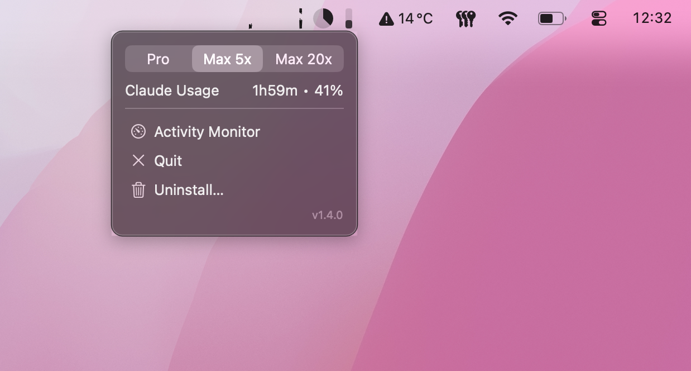

# Stats

A lightweight macOS menu bar app that keeps essential system metrics always visible at a glance.



## What it does

Stats lives in your menu bar and displays four widgets side by side:

- **CPU usage** — A rolling line chart showing your processor activity over the last 5 minutes. Helps you quickly spot if something is consuming too many resources.
- **Network speed** — A mirrored chart showing upload speed on top and download speed on the bottom. Useful to monitor ongoing transfers or detect unexpected network activity.
- **Disk space** — A pie chart showing how much storage is used vs free on your main drive.
- **Claude usage** — A small bar showing your current Claude API usage within the active rate-limit window. Only appears if `~/.claude` exists.

Clicking on the menu bar icon opens a popover with detailed Claude usage (percentage, time remaining, plan selector) and quick actions (Activity Monitor, Quit, Uninstall).

The app starts automatically at login and runs silently in the background with no dock icon or window.

## Install

### Download

1. Go to the [latest release](https://github.com/moifort/minimal-stats/releases/latest)
2. Download `Stats.app.zip`
3. Unzip and move `Stats.app` to your Applications folder
4. Since the app is not notarized, macOS will block it on first launch. Use one of these methods to open it:
   - **Right-click > Open** — right-click the app, select Open, then click Open in the dialog
   - **System Settings** — go to **Privacy & Security**, scroll down, and click **Open Anyway**
   - **Terminal** — run `xattr -cr /Applications/Stats.app` then open normally

### From source

Requires Xcode command line tools and macOS 14+.

```sh
git clone https://github.com/moifort/minimal-stats.git
cd minimal-stats
make install
```

This builds the app and copies it to `/Applications`.

### Uninstall

Click the menu bar icon and select **Uninstall** — this removes the login item and moves the app to the Trash. You can also manually delete `Stats.app` from your Applications folder.
