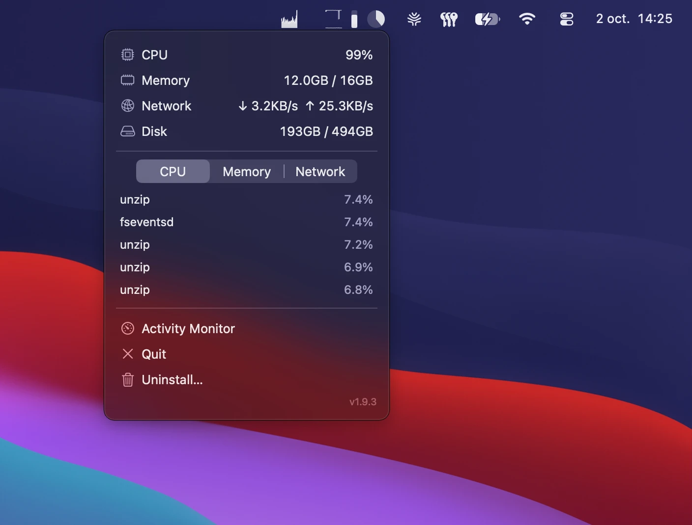

# Stats

A lightweight macOS menu bar app that keeps essential system metrics always visible at a glance.



## What it does

Stats lives in your menu bar and displays four widgets side by side:

- **CPU usage** — A rolling line chart showing your processor activity over the last 5 minutes, on a fixed 0–100% scale.
- **Network speed** — A mirrored chart showing upload speed on top and download speed on the bottom. Loopback, VPN tunnels and VM bridges are ignored so traffic is neither inflated by local connections nor counted twice.
- **Memory** — A vertical gauge filled to the share of RAM in use.
- **Disk space** — A pie chart showing how much storage is used vs available on your main drive (purgeable space counts as available, like in Finder).

Clicking on the menu bar icon opens a popover, updated live while it is open:

- **Live figures** — CPU %, memory used / total, current download and upload speed, the peak speed and the process that used the network most over the last 5 minutes, and free disk space.
- **Top processes** — the five heaviest processes by CPU (as a share of the whole machine), memory, or network traffic over the last 5 minutes. Click one of your own processes to quit it.
- Quick actions (Activity Monitor, Quit, Uninstall) and the app version. The app checks for updates automatically and shows an update button in the popover when a new version is available.

The app starts automatically at login and runs silently in the background with no dock icon or window.

## Install

### Download

1. Go to the [latest release](https://github.com/moifort/minimal-stats/releases/latest)
2. Download `Stats.app.zip`
3. Unzip and move `Stats.app` to your Applications folder
4. Since the app is not notarized, macOS will block it on first launch. Use one of these methods to open it:
   - **Right-click > Open** — right-click the app, select Open, then click Open in the dialog
   - **System Settings** — go to **Privacy & Security**, scroll down, and click **Open Anyway**
   - **Terminal** — run `xattr -cr /Applications/Stats.app` then open normally

### From source

Requires Xcode command line tools and macOS 26+.

```sh
git clone https://github.com/moifort/minimal-stats.git
cd minimal-stats
make install
```

This builds the app and copies it to `/Applications`.

## Update

The app checks for updates automatically once a day. When a new version is available, an update button appears in the popover. Clicking it shows the changelog and installs the update in-place — no need to re-download manually.

### Uninstall

Click the menu bar icon and select **Uninstall** — this removes the login item and moves the app to the Trash. You can also manually delete `Stats.app` from your Applications folder.
